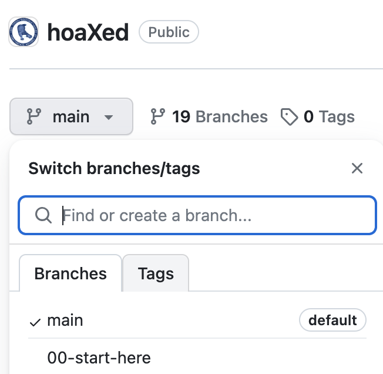

# hoaXed: a digital edition repository and tutorial

## About

hoaXed is a teaching tool intended to guide learners through the iterative development stages of creating a digital edition. This edition is an eXist-db application, though the development stages are not unique to eXist-db or even XQuery.

Using a model-view-controller design pattern to construct an application over 17 stages, the edition helps learners build on their research questions.

In order to create methodologically innovative editions, digital humanists must be able to create bespoke interfaces and approaches that may not be available in existing edition-making platforms. For this reason, this tutorial focuses on guiding a user through an iterative approach. While we use XQuery and include some XQuery-specific instruction, this is not an XQuery tutorial. Some familiarity with XQuery is required, and for those not yet familiar we link to or reference other materials to bring learners up to speed.

This tutorial is an adaptation of an in-person workshop titled “Advanced digital editing: modeling the text and making the edition”, an NEH Institute for Advanced Topics in Digital Humanities. This workshop occurred in July 2022 at the University of Pittsburgh. In-person teaching materials can be found at https://pittsburgh-neh-institute.github.io/Institute-Materials-2020/.

## How to use this tutorial

### GitHub Wiki

[The Wiki](https://github.com/Pittsburgh-NEH-Institute/hoaXed/wiki) for this project is made up of eighteen stages. Each stage corresponds to a branch in the repository. The branch contains the code we write during that specific stage of development. We think of the staged code as a “fast forward” in a cooking show. The tutorial shows you the ingredients and basic steps involved, and at the end a finished dish is presented. While this is not a perfect metaphor, we found it useful to provide a model for the iterative development that happens over weeks or months in a more compressed manner.

### Using the repository locally

To use a stage on your local machine, set up the prerequisite software described in [00-start-here](https://github.com/Pittsburgh-NEH-Institute/hoaXed/wiki/00-start-here).

Next, clone this repository to your local machine. When you want to change branches to move to the next stage, you can use `git checkout ##-stage-name`. If you build and install the eXist-db app from the stages and sync it using VSCode, you should not need to build and install each time you change branches. There are some stages in which you do need to rebuild; we tell you about those as they happen.

### Using this repository on GitHub

If you would prefer to follow along without cloning the repository, you can navigate branches using the branch dropdown menu at the top of the “Code” tab on GitHub.

## Acknowledgements

Advanced digital editing: modeling the text and making the edition is awarded by the NEH Office of Digital Humanities (ODH) and co-funded by the NEH Division of Research Programs. Any views, findings, conclusions, or recommendations expressed in materials developed for this project do not necessarily represent those of the National Endowment for the Humanities.

